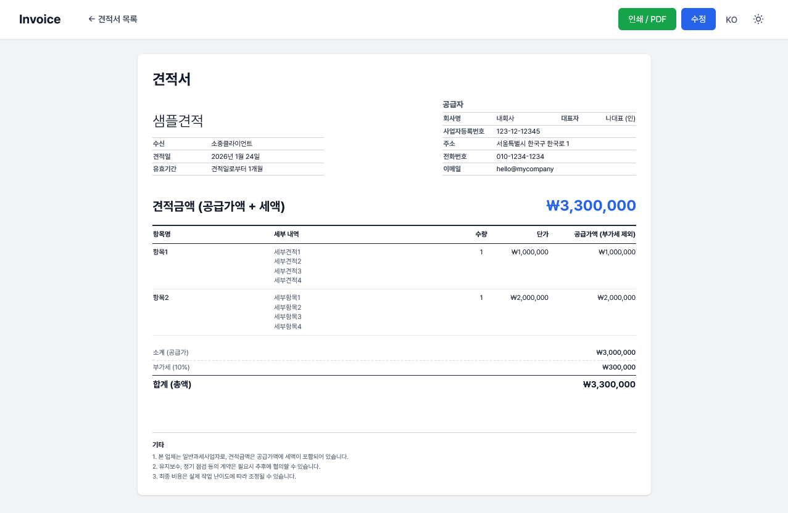
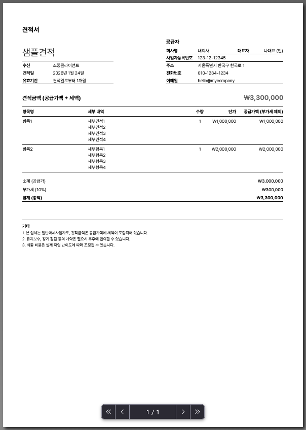

# 견적서 관리 시스템 (Invoice Manager)

다국어 지원(한글/영문)하는 자체 호스팅 기반 견적서 생성 및 관리 웹 애플리케이션입니다.

**언어**: [English](README.md) | [한국어](README.ko.md)

## 개요

Invoice Manager는 여러 회사, 클라이언트, 견적서 템플릿을 관리하고 PDF 내보내기 기능이 있는 전문적인 견적서 생성 및 관리 시스템입니다. 특히 한국형 견적서 양식을 지원하며 다국어 환경에 최적화되어 있습니다.

**주요 기능:**
- ✅ 다중 회사 견적서 생성
- ✅ 다국어 지원 (한글/영문)
- ✅ 거래처 관리
- ✅ 동적 항목 추가 및 자동 계산
- ✅ 재사용 가능한 기타 문구 템플릿
- ✅ PDF 내보내기 및 인쇄
- ✅ 다크 모드 지원
- ✅ Docker 배포 지원
- ✅ SQLite 데이터베이스 (외부 의존성 없음)

## 스크린샷

### 견적서 목록 & 미리보기


### PDF 출력


## 기술 스택

- **백엔드**: Node.js + Express.js
- **데이터베이스**: SQLite (파일 기반, Docker 볼륨으로 영속화)
- **프론트엔드**: EJS 템플릿 + Tailwind CSS
- **스타일링**: Tailwind CSS (다크 모드 지원)
- **인증**: Express-session + bcrypt
- **배포**: Docker & Docker Compose

## 프로젝트 구조

```
invoiceManager/
├── Dockerfile                    # 컨테이너 설정
├── docker-compose.yml            # Docker Compose 설정
├── .env.example                  # 환경변수 템플릿
├── README.md                      # 문서 (영문)
├── README.ko.md                   # 문서 (한국어)
├── app/                           # 애플리케이션 소스코드
│   ├── package.json              # Node.js 의존성
│   ├── src/
│   │   ├── app.js                # Express 애플리케이션 진입점
│   │   ├── config/
│   │   │   └── database.js       # SQLite 설정 및 마이그레이션
│   │   ├── middleware/
│   │   │   ├── auth.js           # 인증 미들웨어
│   │   │   └── i18n.js           # 다국어 미들웨어
│   │   ├── routes/
│   │   │   ├── auth.js           # 로그인/로그아웃
│   │   │   ├── companies.js      # 회사 관리 (CRUD)
│   │   │   ├── clients.js        # 거래처 관리 (CRUD)
│   │   │   ├── invoices.js       # 견적서 관리 (CRUD)
│   │   │   └── templates.js      # 기타 문구 템플릿 관리
│   │   ├── views/                # EJS 템플릿
│   │   │   ├── layout.ejs        # 마스터 레이아웃
│   │   │   ├── login.ejs
│   │   │   ├── dashboard.ejs
│   │   │   ├── companies/
│   │   │   ├── clients/
│   │   │   ├── invoices/
│   │   │   └── templates/
│   │   ├── locales/              # 다국어 번역 파일
│   │   │   ├── ko.json
│   │   │   └── en.json
│   │   ├── public/               # 정적 자산
│   │   └── utils/                # 유틸리티 함수
│   └── scripts/                  # 빌드 스크립트
├── data/                         # SQLite 데이터베이스 (Docker 볼륨)
├── uploads/                      # 회사 로고/서명 (Docker 볼륨)
└── .gitignore                    # Git 무시 규칙
```

## 데이터베이스 스키마

### Companies (회사 정보) 테이블
| 컬럼 | 타입 | 설명 |
|------|------|------|
| id | INTEGER PK | 고유 ID |
| name | TEXT | 회사명 (한글) |
| name_en | TEXT | 회사명 (영문) |
| representative | TEXT | 대표자명 (한글) |
| representative_en | TEXT | 대표자명 (영문) |
| business_number | TEXT | 사업자등록번호 |
| address | TEXT | 주소 (한글) |
| address_en | TEXT | 주소 (영문) |
| phone | TEXT | 전화번호 (한글) |
| phone_en | TEXT | 전화번호 (영문) |
| email | TEXT | 이메일 (한글) |
| email_en | TEXT | 이메일 (영문) |
| bank_info | TEXT | 계좌정보 (한글) |
| bank_info_en | TEXT | 계좌정보 (영문) |
| logo_path | TEXT | 로고 이미지 경로 |
| stamp_path | TEXT | 서명/도장 이미지 경로 |
| invoice_prefix | TEXT | 견적서 번호 접두사 (예: INV, S42) |
| is_default | BOOLEAN | 기본 회사 여부 |
| created_at | DATETIME | 생성일 |

### Clients (거래처) 테이블
| 컬럼 | 타입 | 설명 |
|------|------|------|
| id | INTEGER PK | 고유 ID |
| name | TEXT | 회사/담당자명 |
| business_number | TEXT | 사업자등록번호 |
| contact_person | TEXT | 담당자명 |
| phone | TEXT | 연락처 |
| email | TEXT | 이메일 |
| address | TEXT | 주소 |
| created_at | DATETIME | 생성일 |

### Invoices (견적서) 테이블
| 컬럼 | 타입 | 설명 |
|------|------|------|
| id | INTEGER PK | 고유 ID |
| invoice_number | TEXT | 견적서 번호 (예: INV-2026-0001) |
| company_id | INTEGER FK | 발행 회사 |
| client_id | INTEGER FK | 거래처 |
| project_name | TEXT | 프로젝트명 |
| issue_date | DATE | 견적일 |
| validity_period | TEXT | 유효기간 (예: "견적일로부터 1개월") |
| subtotal | REAL | 소계 (공급가액) |
| tax_rate | REAL | 부가세율 (%) |
| tax_amount | REAL | 부가세 |
| total_amount | REAL | 합계 (총액) |
| notes | TEXT | 기타 문구 (JSON 배열) |
| status | TEXT | 상태 (draft) |
| currency | TEXT | 통화 (KRW, USD, EUR, JPY, GBP, CNY) |
| pdf_path | TEXT | 생성된 PDF 경로 |
| created_at | DATETIME | 생성일 |
| updated_at | DATETIME | 수정일 |

### Invoice Items (견적 항목) 테이블
| 컬럼 | 타입 | 설명 |
|------|------|------|
| id | INTEGER PK | 고유 ID |
| invoice_id | INTEGER FK | 부모 견적서 |
| title | TEXT | 항목명 |
| details | TEXT | 세부 내역 (여러 줄 가능) |
| quantity | REAL | 수량 |
| unit_price | REAL | 단가 |
| amount | REAL | 금액 (수량 × 단가) |
| sort_order | INTEGER | 정렬 순서 |

### Note Templates (기타 문구 템플릿) 테이블
| 컬럼 | 타입 | 설명 |
|------|------|------|
| id | INTEGER PK | 고유 ID |
| title | TEXT | 템플릿명 |
| content | TEXT | 템플릿 내용 |
| is_default | BOOLEAN | 기본 포함 여부 |
| sort_order | INTEGER | 정렬 순서 |
| created_at | DATETIME | 생성일 |

## 설치 및 실행

### 필수 조건
- Docker & Docker Compose 설치
- 포트 3000 사용 가능 (필요시 docker-compose.yml에서 변경)

### 빠른 시작

1. **저장소 복제**
   ```bash
   git clone https://github.com/yourusername/invoice-manager.git
   cd invoice-manager
   ```

2. **환경설정 파일 생성**
   ```bash
   cp .env.example .env
   ```

   `.env` 파일 수정:
   ```env
   NODE_ENV=production
   PORT=3000
   SESSION_SECRET=your-secret-key-here
   ADMIN_USERNAME=admin
   ADMIN_PASSWORD_HASH=bcrypt-hashed-password
   ```

3. **Docker Compose로 실행**
   ```bash
   docker-compose up --build -d
   ```

4. **애플리케이션 접속**
   - 브라우저: `http://localhost:3000`
   - `.env`의 계정으로 로그인

### 수동 설치 (Docker 없이)

1. **의존성 설치**
   ```bash
   npm install
   ```

2. **환경설정 파일 생성**
   ```bash
   cp .env.example .env
   ```

3. **애플리케이션 실행**
   ```bash
   npm start
   ```

   애플리케이션이 `http://localhost:3000`에서 실행됩니다.

### 관리자 비밀번호 변경

관리자 비밀번호를 변경하려면 bcrypt 해시를 생성해야 합니다:

1. **스크립트를 사용해 비밀번호 해시 생성**
   ```bash
   npm run hash-password
   ```

   또는 Docker에서:
   ```bash
   docker exec -it invoice-manager npm run hash-password
   ```

2. **새로운 비밀번호 입력**
   - 스크립트가 bcrypt 해시를 출력합니다

3. **`.env` 파일 수정**
   ```env
   ADMIN_PASSWORD_HASH='<생성된-해시-붙여넣기>'
   ```

4. **애플리케이션 재시작**
   ```bash
   docker-compose restart invoice-manager
   ```

   또는 일반 실행:
   ```bash
   npm start
   ```

재시작 후 새로운 비밀번호가 즉시 활성화됩니다.

## 사용 방법

### 1. 로그인
애플리케이션에 접속해 관리자 계정으로 로그인합니다.

### 2. 회사 정보 관리
- **회사** 메뉴로 이동
- 한글/영문 탭을 이용해 회사 정보 입력
- 로고와 서명/도장 이미지 업로드
- 기본 회사 설정

### 3. 거래처 관리
- **거래처** 메뉴로 이동
- 거래처 정보 등록
- 거래처 정보 조회, 수정, 삭제

### 4. 견적서 작성
- **새 견적서** 클릭
- 회사와 거래처 선택
- 항목 추가 (항목명, 상세 내역, 수량, 단가)
- 시스템에서 자동으로 금액 계산
- 기타 문구 템플릿 선택 또는 직접 입력
- 견적서 저장

### 5. 보기 및 내보내기
- 견적서 클릭해 상세보기
- 한글/영문 언어 전환
- 인쇄 또는 PDF로 내보내기
- 견적서 복제로 빠른 생성

### 6. 템플릿 관리
- 자주 쓰는 문구를 템플릿으로 저장
- 기본 포함 설정 가능 (새 견적서에 자동 포함)
- 예시: 결제 조건, 서비스 약관, 회사 정책 등

## 주요 기능

### 다중 회사 지원
- 여러 회사/지사 등록 가능
- 각 회사별 로고, 서명, 견적서 번호 접두사 관리
- 기본 회사 설정 가능

### 다국어 인터페이스
- 한글과 영문 완벽 지원
- 언제든지 언어 전환 가능
- 회사 정보를 두 가지 언어로 저장
- 견적서를 선택한 언어로 표시

### 동적 항목 관리
- 견적서 작성 중 항목 추가/삭제 가능
- 항목 상세 내역을 여러 줄로 입력 가능
- 자동으로 금액 계산
- 여러 통화 지원 (KRW, USD, EUR, JPY, GBP, CNY)

### 전문 템플릿
- 사전 정의된 기타 문구 템플릿 (결제 조건, 정책 등)
- 커스텀 템플릿 생성 가능
- 템플릿을 기본 포함으로 설정 가능

### PDF 내보내기
- 인쇄 친화적인 견적서 레이아웃
- 회사 로고와 서명 포함
- 한글 폰트 지원
- 브라우저에서 직접 PDF 다운로드

### 다크 모드
- 밝은 모드/어두운 모드 전환
- 브라우저 쿠키에 설정 저장
- 전체 인터페이스에 일관된 스타일 적용

## Docker 배포

### Docker Compose 설정

```yaml
services:
  invoice:
    build: .
    container_name: invoice-manager
    restart: unless-stopped
    expose:
      - "3000"
    volumes:
      - invoice-data:/app/data          # SQLite 데이터베이스
      - invoice-uploads:/app/uploads    # 회사 이미지
    env_file:
      - .env
    environment:
      - TZ=Asia/Seoul
      - NODE_ENV=production
    networks:
      - shared

volumes:
  invoice-data:
  invoice-uploads:

networks:
  shared:
    external: true
```

### Nginx 리버스 프록시 설정

nginx.conf에 추가:

```nginx
upstream docker-invoice {
    server invoice-manager:3000;
}

server {
    listen 80;
    server_name invoice.example.com;
    server_tokens off;

    location / {
        proxy_http_version 1.1;
        proxy_set_header Host $host;
        proxy_set_header X-Real-IP $remote_addr;
        proxy_set_header X-Forwarded-For $proxy_add_x_forwarded_for;
        proxy_set_header X-Forwarded-Proto https;
        proxy_pass http://docker-invoice;
    }
}
```

## 환경 변수

| 변수 | 설명 | 기본값 |
|------|------|--------|
| NODE_ENV | 실행 환경 (development/production) | production |
| PORT | 서버 포트 | 3000 |
| SESSION_SECRET | 세션 암호화 키 | fallback-secret-key |
| ADMIN_USERNAME | 로그인 사용자명 | admin |
| ADMIN_PASSWORD_HASH | bcrypt 해시된 비밀번호 | (필수) |
| HTTPS | 프로덕션 HTTPS 활성화 | false |
| TZ | 타임존 | Asia/Seoul |

## 보안

- **인증**: Express-session + httpOnly 쿠키
- **비밀번호**: bcrypt 해싱으로 안전 저장
- **입력 검증**: 서버 측 검증
- **파일 업로드**: 이미지 파일만 허용 (jpeg, jpg, png, gif, webp)
- **데이터베이스**: 매개변수화된 쿼리로 SQL 주입 방지

## 문제 해결

### 애플리케이션 실행 안 됨
```bash
# 로그 확인
docker-compose logs -f invoice-manager

# 컨테이너 재빌드
docker-compose down
docker-compose up --build -d
```

### 데이터베이스 잠금 오류
```bash
# 애플리케이션 재시작
docker-compose restart invoice-manager
```

### 업로드된 파일이 보이지 않음
- Docker 볼륨이 제대로 마운트되었는지 확인: `docker volume ls`
- 파일 권한 확인
- 업로드 디렉토리 확인: `docker-compose exec invoice-manager ls -la /app/uploads`

## 성능 최적화 팁

1. **데이터베이스 최적화**: 주기적인 SQLite 유지보수
2. **이미지 최적화**: 업로드 전 로고/서명 이미지 압축
3. **브라우저 캐시**: 스타일 업데이트 시 캐시 삭제
4. **타임존**: 위치에 맞는 TZ 변수 설정

## 지원 브라우저

- Chrome/Edge 90 이상
- Firefox 88 이상
- Safari 14 이상
- 모바일 브라우저 (iOS Safari, Chrome Mobile)

## 후원

Invoice Manager가 도움이 되었다면 개발을 지원해주세요:

### GitHub Sponsors
- [GitHub Sponsors](https://github.com/sponsors/icq4ever)

### 한국
카카오페이로 후원:


여러분의 후원이 이 프로젝트를 계속 유지하고 개선하는 데 큰 힘이 됩니다!

## 라이선스

이 프로젝트는 **GNU Affero General Public License v3 (AGPL v3)** 라이선스를 따릅니다.

자세한 내용은 [LICENSE](LICENSE) 파일을 참고하세요.

**이것이 의미하는 바:**
- ✅ Invoice Manager를 자유롭게 사용하고 수정할 수 있습니다
- ✅ 자신의 인프라에서 자유롭게 호스팅할 수 있습니다
- ✅ 수정 사항은 같은 AGPL v3 라이선스로 공유해야 합니다
- ✅ 이 소프트웨어를 웹 서비스로 사용하면 소스 코드를 공개해야 합니다
- ❌ 이 코드를 사용해 폐쇄형 상업 서비스를 만들 수 없습니다

## 기여

기여를 환영합니다:
1. 저장소 포크
2. 기능 브랜치 생성
3. 명확한 메시지로 커밋
4. 풀 리퀘스트 제출

## 지원

문제 및 질문:
1. GitHub의 기존 이슈 확인
2. 새 이슈 생성 (상세 정보 포함)
3. 에러 로그 및 스크린샷 첨부

## 로드맵

- [ ] 견적서 상태 관리 (발송, 수락, 거절)
- [ ] 저장 시 자동 PDF 생성
- [ ] 이메일로 견적서 전달
- [ ] 결제 추적
- [ ] 고급 보고서 및 분석
- [ ] 제3자 통합 API
- [ ] 다중 사용자 지원 및 역할 기반 접근

## 크레딧

Node.js, Express, Tailwind CSS로 만들어졌습니다. ❤️

---

**버전**: 1.0.0
**마지막 업데이트**: 2026년 1월
