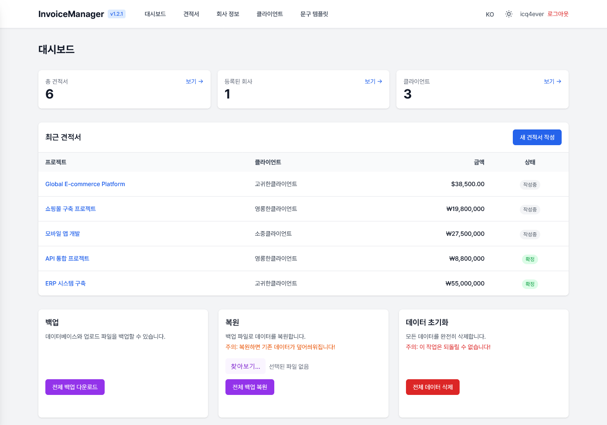
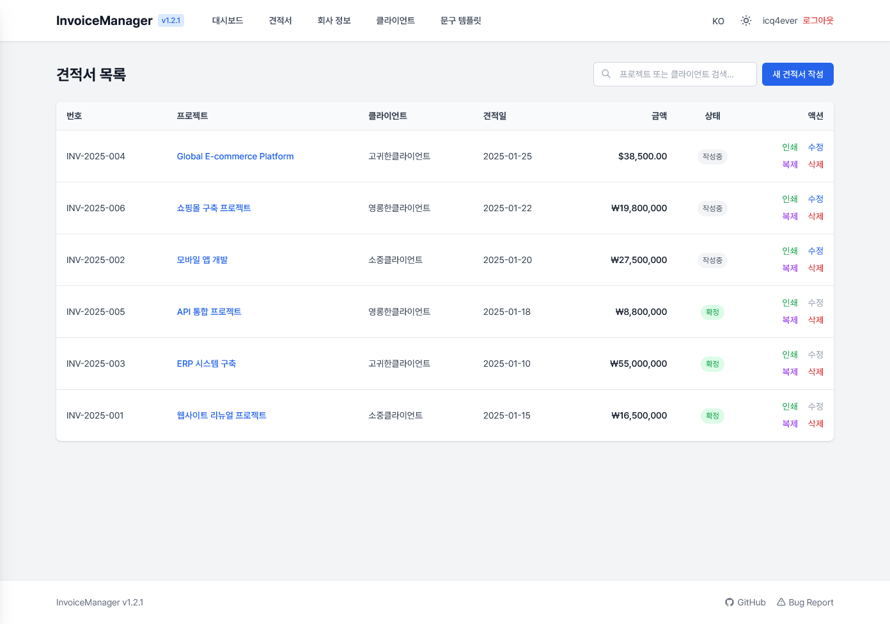
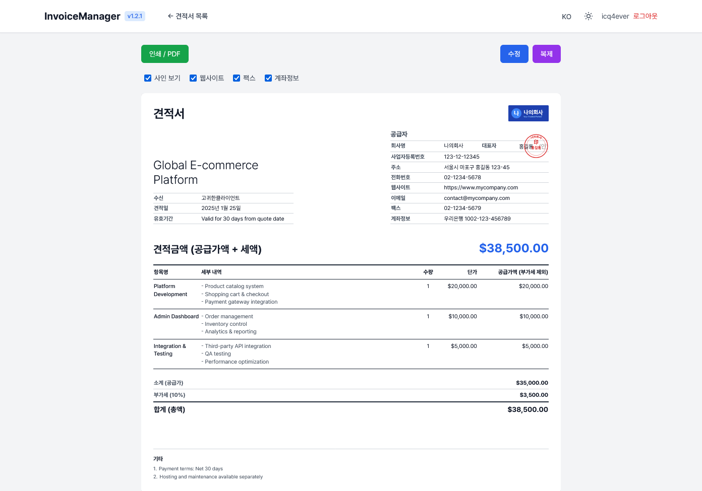
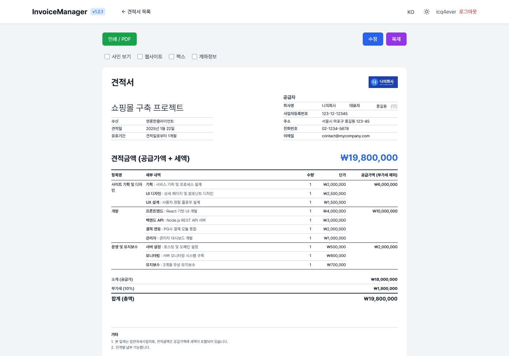
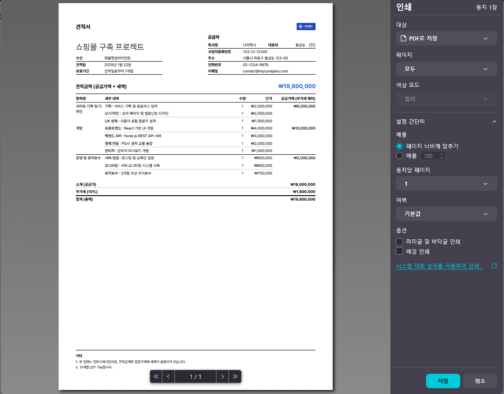
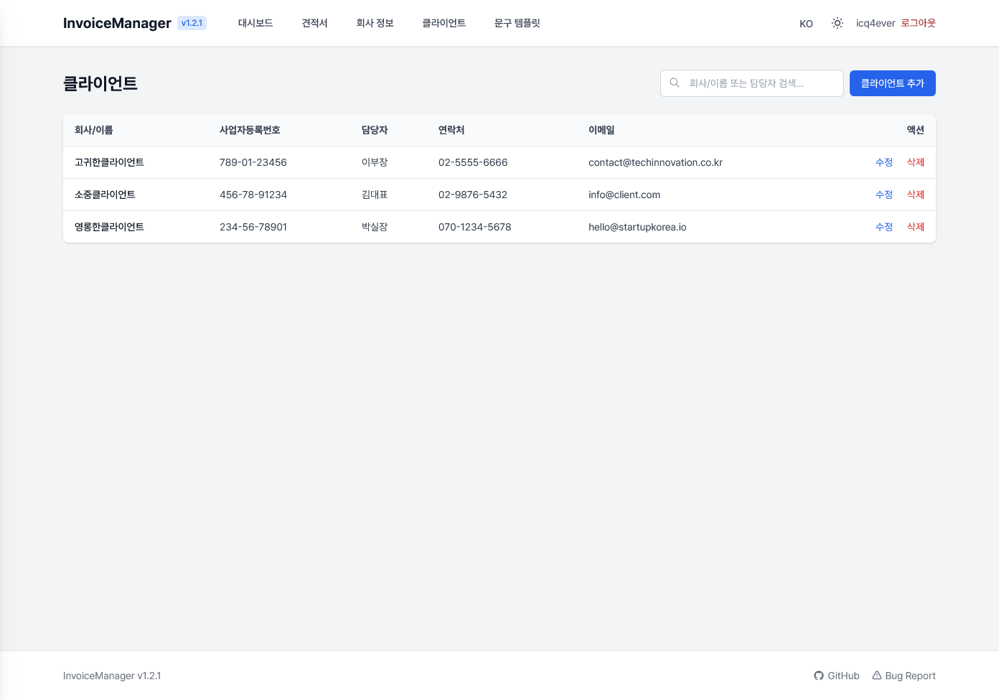

# Invoice Manager

A self-hosted web application for generating and managing multi-company invoices with multilingual support (Korean/English).

[](https://github.com/icq4ever/invoiceManager) 

**Language**: [English](README.md) | [한국어](README.ko.md)

## Features

- Multi-company invoice generation
- Bilingual support (Korean/English)
- Client management
- Dynamic invoice items with automatic calculations
- Reusable note templates
- PDF export and printing
- Dark mode support
- Backup & Restore
- Docker deployment ready

## Screenshots

### Dashboard


### Invoice List


### Invoice Form - Simple Text Mode


### Invoice Form - Itemized Details Mode


### Invoice Print Preview


### Client List


## Quick Start

```bash
# Clone repository
git clone https://github.com/yourusername/invoice-manager.git
cd invoice-manager

# Setup environment
cp .env.example .env

# Run with Docker
docker compose up --build -d

# Set up admin credentials
docker exec -it invoice-manager npm run set-credentials

# Access at http://localhost:3006
```

> **Note**: On first launch, the login page will show setup instructions until you run the `set-credentials` command. You can re-run it anytime to change the admin username or password.

### Using with a shared Nginx reverse proxy

If you run a single Nginx container as a reverse proxy for multiple services on a shared Docker network, you need to connect the invoice-manager container to that network:

```bash
# Connect to your shared network (run after docker compose up)
docker network connect shared invoice-manager

# Reload Nginx to resolve the new upstream
docker exec nginx nginx -s reload
```

Or, change `external: false` to `external: true` in `docker-compose.yml` under `networks.shared` so it automatically joins the existing network.

## Tech Stack

- **Backend**: Node.js + Express.js
- **Database**: SQLite
- **Frontend**: EJS + Tailwind CSS
- **Deployment**: Docker

## Documentation

| Document | Description |
|----------|-------------|
| [Installation](docs/installation.md) | Setup guide & environment variables |
| [Usage](docs/usage.md) | How to use the application |
| [Docker](docs/docker.md) | Docker deployment & Nginx setup |
| [Database](docs/database.md) | Database schema reference |
| [Troubleshooting](docs/troubleshooting.md) | Common issues & solutions |

## Support

If you find Invoice Manager useful, consider supporting its development:

- [GitHub Sponsors](https://github.com/sponsors/icq4ever)
- Kakao Pay: <br/>


## License

**GNU Affero General Public License v3 (AGPL v3)**

- You can use and modify freely
- Modifications must be shared under AGPL v3
- Web service usage requires source code disclosure

See [LICENSE](LICENSE) for details.

## Roadmap

- [x] Invoice status management (draft, confirmed, discarded)
- [x] Email invoice delivery
- [ ] Payment tracking
- [ ] Multi-user support

## Contributing

1. Fork the repository
2. Create a feature branch
3. Submit a pull request

## Changelog

### v1.2.5
- Added recipient address display option (toggle per invoice, supports multi-line with Shift+Enter)
- Renamed "Date" label to "Issued" in English locale
- Fixed email body newline rendering (textarea line breaks now show as `<br>` in HTML email)
- Sanitized template variables: `\n` in project name replaced with space to prevent subject truncation
- Email template uses English company name (`company_name_en`) when invoice language is English
- Made "From Email" field readonly in email send modal (determined by SMTP settings)
- Improved email PDF layout to match HTML invoice preview
  - Logo rendering fix (NaN error resolved)
  - Bottom-aligned left/right header columns
  - Full-width summary section (Subtotal/Tax/Total)
  - Dynamic row height for multi-line addresses
  - Notes positioned at page bottom
  - Bank/PayPal display respects invoice preview settings

### v1.2.4
- Added business registration certificate upload for clients (image/PDF)
- Added client detail page with document preview and download
- Client name in list is now clickable to view details
- Added shared Nginx reverse proxy setup guide to README

### v1.2.3
- Added email invoice delivery with SMTP settings and templates
- PDF generation using PDFKit (no Chromium dependency)
- Email PDF attachment now reflects user-adjusted column widths from the invoice view
- Moved admin credentials from .env to database (`set-credentials` command)
- Fixed Docker build: removed app bind mount to prevent cross-platform native module issues
- Respects user language preference in PDF generation

### v1.2.2
- Added data reset feature to dashboard with confirmation dialog
- Invoice number column now visible in desktop view (640px+) instead of XL only (1280px+)
- Fixed newline handling in invoice details for proper text formatting
- Updated README with 6 detailed screenshots showcasing all major features

### v1.2.0
- Mobile UI improvements
  - Added GitHub and Bug Report links to mobile side menu
  - Full-width divider between navigation sections
  - Improved dashboard stat card padding
  - Added clear (X) button to search input
- Shortened restore description text for single-line display
- Various UI consistency improvements

### v1.1.0
- Added itemized invoice details mode (sub-items with individual pricing)
- Added invoice status management with dropdown (draft/confirmed/discarded)
- Edit disabled for confirmed/discarded invoices
- Delete confirmation with "cannot restore" warning
- Hybrid search and pagination for invoice/client lists
- Simplified restore UI (full backup only)
- Added database schema version tracking
- Improved invoice view table styling
- Added GitHub link to navigation menu
- Added website and fax fields for company information
- Per-invoice display options (stamp, website, fax, bank info visibility)
- Resizable table columns in invoice preview - drag column headers to adjust widths (saved per invoice)
- Duplicate button in invoice preview page
- Dynamic version badge in navigation header (from package.json)
- Fixed PDF/browser preview style inconsistency (border colors and item group separators)

### v1.0.1
- Fixed invoice prefix not being duplicated when copying invoices
- Bug fixes and improvements

### v1.0.0
- Initial release

---

**Version**: 1.2.2 | Built with Node.js, Express, and Tailwind CSS
